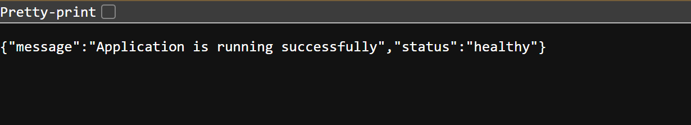
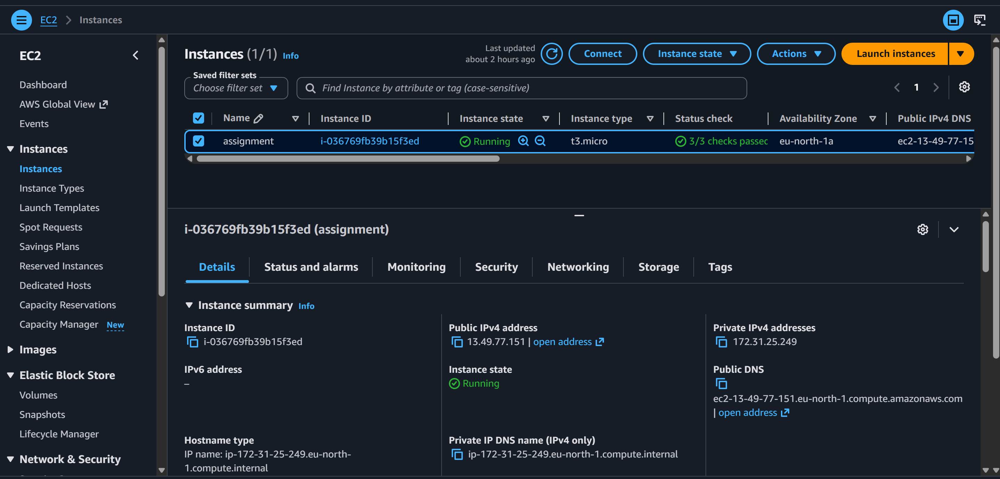
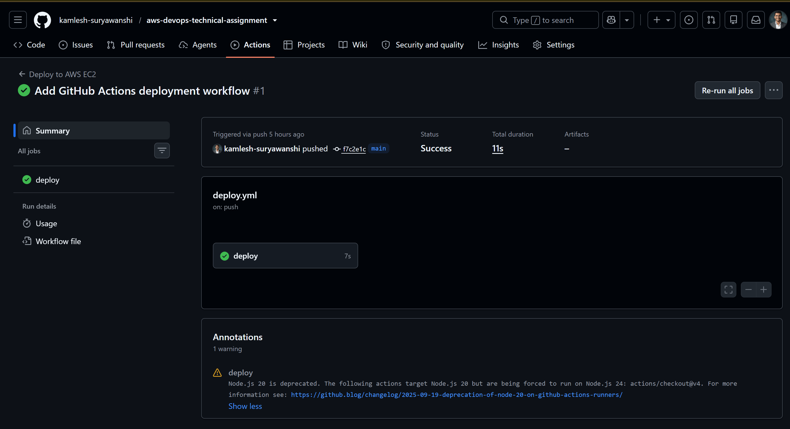
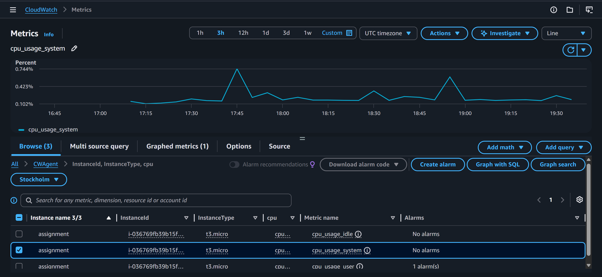
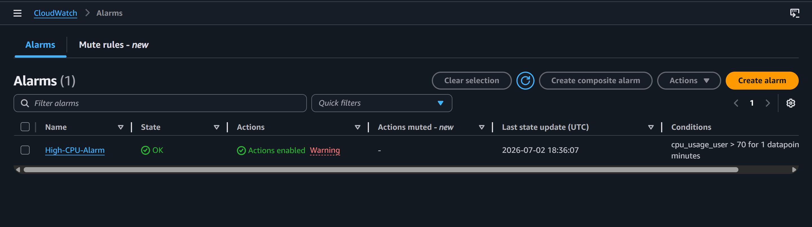
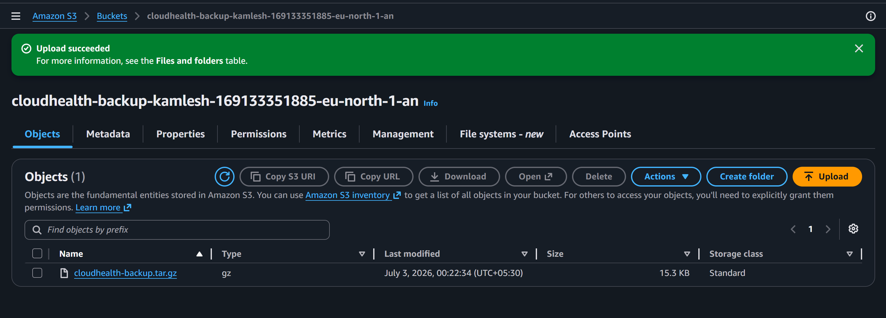
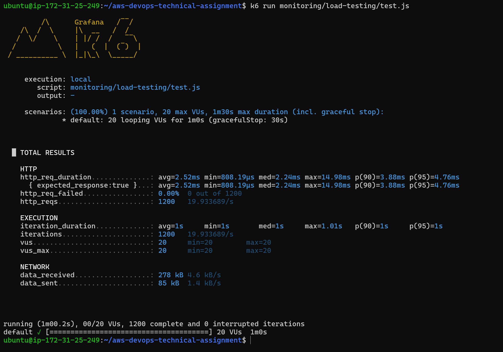

# AWS DevOps Deployment Pipeline

A Dockerized Flask REST API deployed on AWS following production-style DevOps practices — automated CI/CD, monitoring and alerting, backups, and load testing, all built on AWS Free Tier services.

---

## Table of Contents

- [Project Overview](#project-overview)
- [Application Preview](#application-preview)
- [Architecture](#architecture)
- [Technologies Used](#technologies-used)
- [Project Structure](#project-structure)
- [Features](#features)
- [Prerequisites](#prerequisites)
- [Deployment](#deployment)
- [API Endpoints](#api-endpoints)
- [Environment Variables](#environment-variables)
- [Monitoring](#monitoring)
- [Load Testing](#load-testing)
- [Security](#security)
- [Screenshots](#screenshots)
- [Deliverables Checklist](#deliverables-checklist)
- [Future Improvements](#future-improvements)
- [Author](#author)

---

## Project Overview

This project demonstrates the end-to-end deployment of a Dockerized Flask REST API on AWS. The application runs on an Amazon EC2 instance behind Nginx as a reverse proxy, is deployed automatically via a GitHub Actions CI/CD pipeline, is monitored using Amazon CloudWatch (metrics, logs, and alarms), is backed up to Amazon S3, and has been performance/load tested using k6.

---

## Application Preview

The application is deployed on an AWS EC2 instance and is accessible through Nginx. The screenshot below shows the running application.



---

## Architecture

```
Developer
    │
    ▼
GitHub Repository
    │
    ▼
GitHub Actions (CI/CD)
    │
    ▼
SSH Deployment
    │
    ▼
Amazon EC2 (Ubuntu)
    │
 ┌──┴───────────────┐
 ▼                   ▼
Docker           CloudWatch Agent
 │                   │
 ▼                   ▼
Flask API        Metrics & Logs
 │                   │
 ▼                   ▼
Nginx            CloudWatch Alarm
 │                   │
 ▼                   ▼
Internet          Amazon SNS

Project Backup
      │
      ▼
  Amazon S3
```

A full architecture diagram (image) is available in `docs/Architecture.md` / `images/`.

### Architecture Overview

The project is deployed on an Amazon EC2 instance using Docker. GitHub Actions automatically deploys updates via SSH. Nginx acts as a reverse proxy, while Amazon CloudWatch monitors the application and Amazon SNS sends alert notifications. Project backups are stored in Amazon S3.

---

## Technologies Used

- Python 3
- Flask
- Docker
- Nginx
- GitHub Actions
- AWS EC2
- Amazon CloudWatch
- Amazon SNS
- Amazon S3
- k6
- Linux (Ubuntu)

---

## Project Structure

```
aws-devops-technical-assignment/
│
├── .github/
│   └── workflows/
│       └── deploy.yml
│
├── app/
│   ├── app.py
│   ├── Dockerfile
│   └── requirements.txt
│
├── docs/
│   ├── Architecture.md
│   ├── Deployment.md
│   ├── Monitoring.md
│   ├── Security.md
│   └── LoadTesting.md
│
├── images/
│
├── load-testing/
│   ├── test.js
│   └── results.txt
│
├── README.md
└── .gitignore
```

---

## Features

- Dockerized Flask REST API
- Nginx Reverse Proxy
- Automated CI/CD using GitHub Actions
- Deployment on AWS EC2
- Amazon CloudWatch Monitoring
- CloudWatch Metrics & Logs
- CloudWatch Alarm with Amazon SNS
- Amazon S3 Backup
- k6 Performance Testing

---

## Prerequisites

- AWS account (Free Tier eligible)
- GitHub account with repository access
- SSH key pair for EC2 access
- Docker installed locally (for testing before deployment)
- k6 installed locally (for running/replaying load tests)

---

## Deployment

1. Launch AWS EC2 instance (Ubuntu, `t2.micro` — Free Tier)
2. Install Docker on the instance
3. Build and deploy the Flask API using Docker
4. Configure Nginx as a reverse proxy in front of the container
5. Configure GitHub Actions for CI/CD (build → push → SSH deploy)
6. Install and configure the CloudWatch Agent on EC2
7. Configure CloudWatch metrics and log groups
8. Configure a CloudWatch alarm with SNS email notification
9. Back up project artifacts to a private Amazon S3 bucket
10. Perform load testing using k6

Detailed step-by-step instructions are available in **[docs/Deployment.md](docs/Deployment.md)**.

---

## API Endpoints

| Method | Endpoint | Description |
|--------|----------|-------------|
| GET | `/` | Health check / welcome message |
| GET | `/health` | Returns application health status |

---

## Environment Variables

| Variable | Description | Example |
|----------|-------------|---------|
| `FLASK_ENV` | Application environment | `production` |
| `PORT` | Port the Flask app listens on | `5000` |

The deployment workflow uses GitHub Actions Secrets to securely store deployment credentials such as:

- `EC2_HOST`
- `EC2_USER`
- `EC2_SSH_KEY`

Sensitive credentials are never committed to the repository.

---

## Monitoring

Amazon CloudWatch is used to monitor:

- CPU usage
- Memory usage
- Disk usage
- Application logs
- Nginx access logs
- Nginx error logs

A CloudWatch alarm triggers an email notification via Amazon SNS whenever CPU utilization exceeds the configured threshold.

More details are available in **[docs/Monitoring.md](docs/Monitoring.md)**.

---

## Load Testing

Load testing was performed using **k6**.

### Test Configuration

- Virtual Users: 20
- Duration: 1 minute

### Results

| Metric | Value |
|---|---:|
| Total Requests | 1,200 |
| Average Response Time | 2.58 ms |
| Maximum Response Time | 18.13 ms |
| Throughput | 19.93 req/s |
| Error Rate | 0% |

Detailed test results are available in **[docs/LoadTesting.md](docs/LoadTesting.md)** and the raw k6 output is included in **[load-testing/results.txt](load-testing/results.txt)**.

---

## Security

Implemented security measures include:

- IAM role for EC2 (least privilege)
- Security Groups restricting inbound access to required ports only
- Nginx reverse proxy (application not directly exposed)
- CloudWatch monitoring and alerting
- Private S3 bucket (no public access) for backups
- SSH access restricted to deployment key only

Additional details are available in **[docs/Security.md](docs/Security.md)**.

---

## Screenshots

### Amazon EC2 Instance



---

### GitHub Actions CI/CD



---

### CloudWatch Metrics



---

### CloudWatch Alarm



---

### Amazon S3 Backup



---

### k6 Load Testing Results



---

## Deliverables Checklist

| Deliverable | Location |
|---|---|
| Git repository | This repo |
| Deployment guide | `docs/Deployment.md` |
| Architecture diagram | `docs/Architecture.md` / `images/` |
| Pipeline configuration | `.github/workflows/deploy.yml` |
| Monitoring screenshots | `images/` |
| Load testing report (graphs + observations) | `docs/LoadTesting.md`, `load-testing/results.txt` |
| Security summary | `docs/Security.md` |
| Implementation/demo video (5–10 min) | To be submitted separately |
| Final report (PDF/DOCX) | To be submitted separately |

---

## Future Improvements

- HTTPS using Let's Encrypt
- Application Load Balancer (ALB)
- Auto Scaling Group
- Terraform Infrastructure as Code
- Kubernetes Deployment
- Redis Caching

---

## Author

**Kamlesh Suryawanshi**

Computer Science Engineering Student

- GitHub: [github.com/kamlesh-suryawanshi](https://github.com/kamlesh-suryawanshi)
- LinkedIn: [linkedin.com/in/kamlesh-suryawanshi-3105b227b](https://www.linkedin.com/in/kamlesh-suryawanshi-3105b227b)
